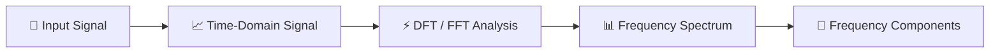
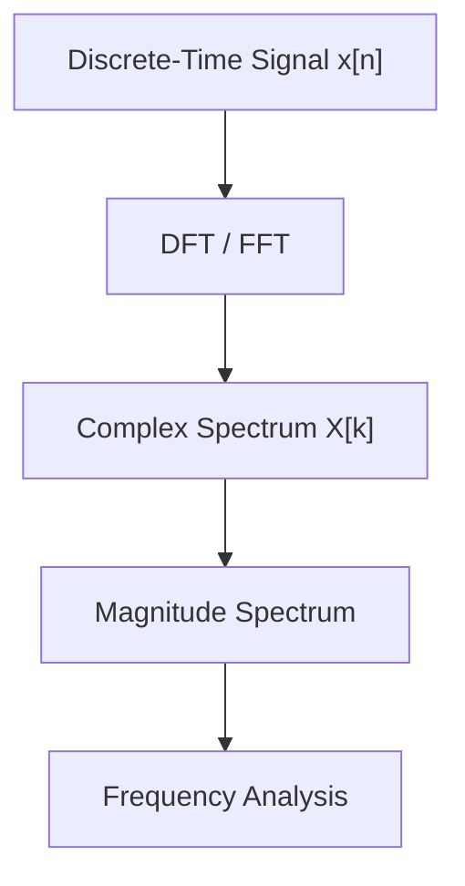
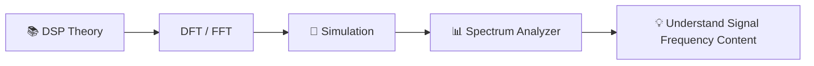

# 🎛️ Digital Spectrum Analyzer Simulation

A DSP course project that simulates the basic operation of a **digital spectrum analyzer** using Python.

The project is designed to show how a sampled signal can be represented and analyzed in the **frequency domain**, allowing users to see which frequency components are present in a signal and how strong they are.

## 🎯 What Does the Project Do?

The application receives a signal from either a generated test signal or a WAV audio file and analyzes its frequency content.

The main concept is:



The application allows users to:

- Generate simple signals such as sine, multi-sine, and square waves.
- Load a WAV audio signal for analysis.
- View the input signal in the time domain.
- Calculate and display its frequency spectrum.
- Observe the amplitude of different frequency components.
- Identify dominant frequencies in the signal.
- Compare how the spectrum changes under different analysis conditions.

## 📚 DSP Knowledge Applied

The project applies the main concepts from the frequency-analysis topics studied in the DSP course:

- **DTFT** – understanding the frequency-domain representation of discrete-time signals.
- **DFT** – representing the spectrum using discrete frequency samples.
- **FFT** – an efficient way to calculate the DFT.
- **Windowing** – studying the effect of finite-length signal analysis.
- **Frequency resolution** – understanding the ability to distinguish nearby frequencies.
- **Spectral leakage** – observing how energy spreads between frequency bins.
- **Magnitude spectrum** – determining the strength of frequency components.

The main relationship is:



## 🖥️ Main Application

The final application is intended to behave like a simple software-based spectrum analyzer:

```text
┌───────────────────────────────────────────┐
│        DIGITAL SPECTRUM ANALYZER          │
├───────────────────────────────────────────┤
│                                           │
│  Time-Domain Signal                       │
│                                           │
│  ~~~~~~~~ waveform ~~~~~~~~~~~~~~~        │
│                                           │
├───────────────────────────────────────────┤
│                                           │
│  Frequency Spectrum                       │
│                                           │
│          /\                               │
│         /  \              /\              │
│ _______/____\____________/  \________     │
│                                           │
├───────────────────────────────────────────┤
│ Dominant Frequency: 1000 Hz               │
│ FFT Size: 1024                            │
│ Window: Hamming                            │
└───────────────────────────────────────────┘
```

The focus is on **understanding and demonstrating frequency-domain analysis**, rather than reproducing all functions of a professional measurement instrument.

## 🔬 What Will Be Demonstrated?

The project will demonstrate typical DSP situations such as:

- A single-frequency signal producing one main spectral component.
- A signal containing multiple frequencies producing multiple peaks.
- Two nearby frequencies and the effect of frequency resolution.
- A frequency that does not align exactly with an FFT bin and the resulting spectral leakage.
- Different window functions and their influence on the observed spectrum.
- Harmonic components of non-sinusoidal signals such as square waves.
- Analysis of real audio data from WAV files.

## 🧠 Core Idea

The project connects the mathematical concepts learned in class with a practical application:



In other words, instead of only calculating DFT/FFT values for individual exercises, the project uses those concepts to build a small tool that can **analyze and visualize the frequency content of signals**.

## 🛠️ Technologies

- **Python 3**
- **NumPy**
- **SciPy**
- **Matplotlib**
- **Tkinter**
- **SoundFile**

## 👥 Team

**DSP Course Project — 3 Members**

The project is divided into three main areas:

- 🎵 Input signal and preprocessing
- ⚡ DFT / FFT processing
- 📊 Spectrum analysis and visualization

## Tool

|Tool|Version|
|---|---|
|python|3.13.12|

```py
python --version
```
```py
pip install numpy scipy matplotlib soundfile
```

