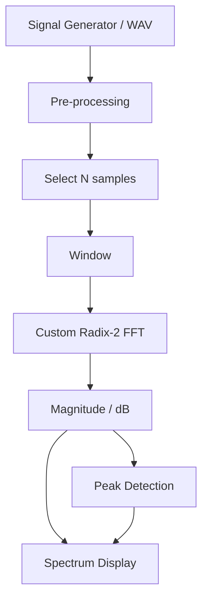
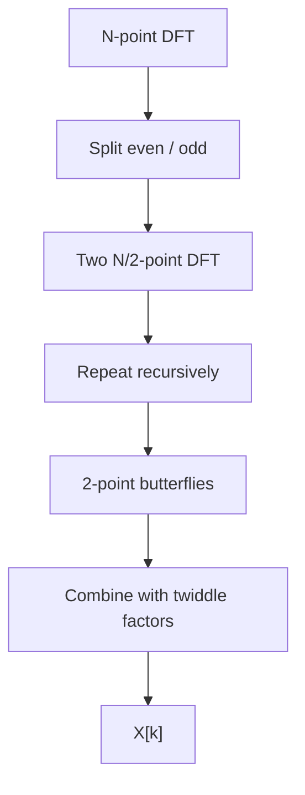
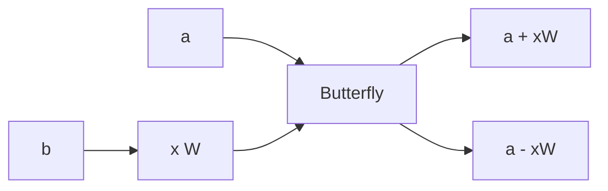
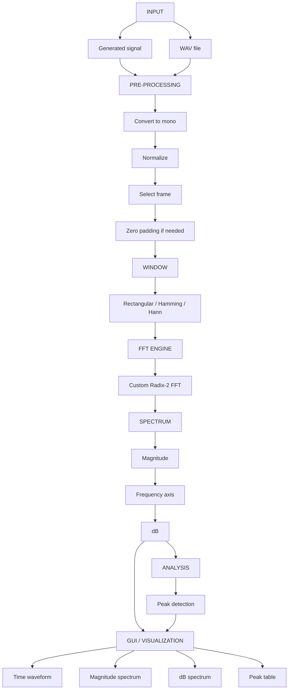
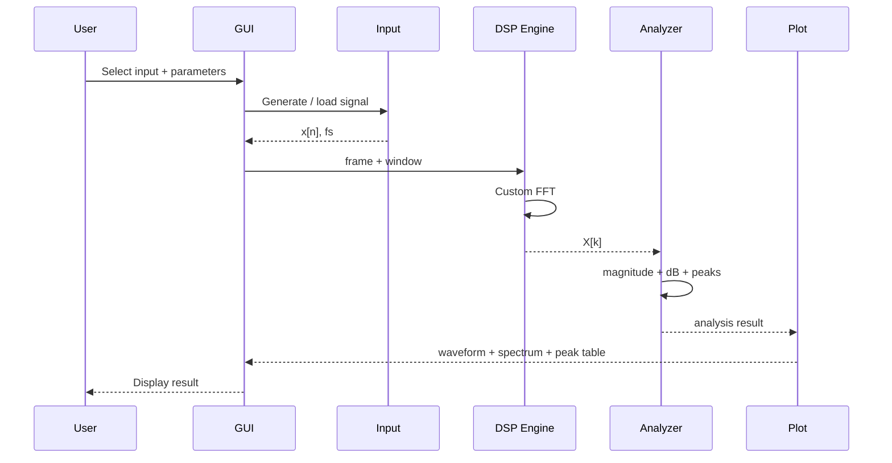
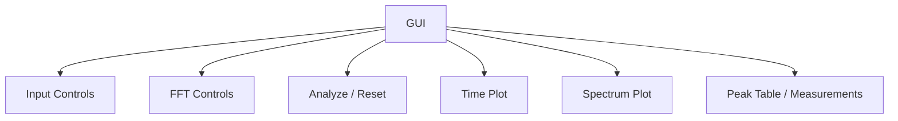
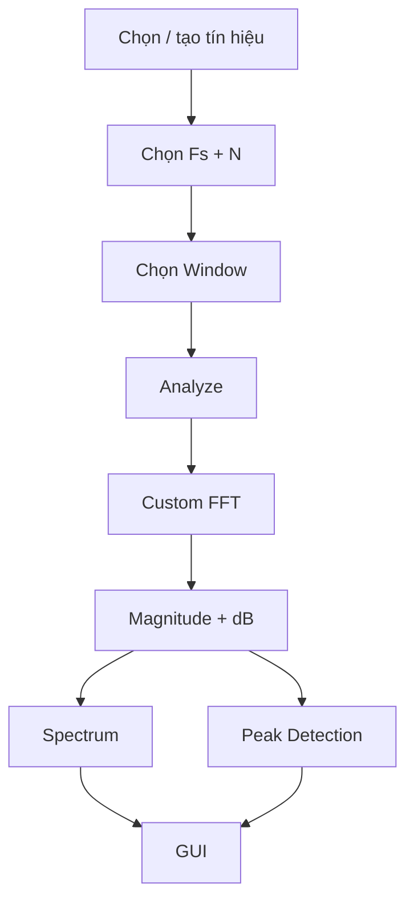

# REQUIREMENT 01 — Mô phỏng máy phân tích phổ tín hiệu số

## 1. Thông tin chung

- **Đề tài:** Mô phỏng máy phân tích phổ tín hiệu số sử dụng DFT/FFT
- **Tên tiếng Anh:** Digital Spectrum Analyzer Simulation Using DFT/FFT
- **Quy mô:** Nhóm 3 người
- **Thời gian:** Khoảng 1 tháng
- **Ngôn ngữ:** Python 3
- **Môi trường:** Windows/Linux, VS Code hoặc IDE tương đương
- **Thư viện chính:** NumPy, SciPy, Matplotlib; GUI dùng Tkinter

> Tài liệu này mô tả **bài toán, kiến thức cần áp dụng, phạm vi, kiến trúc và các kết quả cần đạt**. Phần 2 sẽ mô tả chi tiết cách tổ chức source code và chia task cho từng thành viên.

---

## 2. Tổng quan

Mục tiêu là xây dựng một chương trình có giao diện giống một **spectrum analyzer đơn giản**.

Người dùng đưa một tín hiệu vào chương trình theo một trong hai cách:

1. **Tạo tín hiệu bằng chương trình**: sine, multi-sine, square.
2. **Nạp file WAV** để phân tích một đoạn tín hiệu thực tế.

Chương trình lấy một đoạn gồm N mẫu, áp dụng hàm cửa sổ (window), tính FFT (tự làm, không sử dụng thư viện python), chuyển kết quả thành phổ biên độ/phổ dB và tìm các đỉnh tần số, hiển thị giao diện phổ và các thông tin cần thiết.



Ví dụ người dùng tạo:

\[
x[n] = \sin(2\pi1000n/f_s) + 0.5\sin(2\pi3000n/f_s)
\]

thì chương trình phải hiển thị hai thành phần chính khoảng **1 kHz** và **3 kHz**.

---

## 3. Yêu cầu

Bài tập không chỉ là gọi `numpy.fft.fft()` rồi vẽ biểu đồ.

Nhóm phải thực hiện ba phần liên kết với nhau:

### Phần A — Áp dụng kiến thức chương học

- DTFT ở mức khái niệm để hiểu spectrum.
- DFT và IDFT.
- FFT và IFFT ở mức khái niệm.
- Radix-2 FFT.
- Butterfly.
- Bit-reversal.
- Frequency resolution.
- Windowing.
- Spectral leakage.
- Tính đối xứng của phổ tín hiệu thực.

### Phần B — Tự xây dựng thuật toán

- Tự cài DFT trực tiếp.
- Tự cài FFT Radix-2 làm thuật toán chính.
- Tính magnitude spectrum.
- Tạo frequency axis.
- Chuyển sang dB.
- Phát hiện peak.

### Phần C — Đầu ra sản phẩm

- Có input signal rõ ràng.
- Có GUI.
- Có đồ thị miền thời gian.
- Có phổ FFT.
- Có bảng peak.
- Có các thí nghiệm định lượng để chứng minh hệ thống hoạt động đúng.

---

## 4. Kiến thức từ chương học được sử dụng

### 4.1. DTFT — dùng để hiểu khái niệm spectrum

DTFT mô tả phổ của tín hiệu rời rạc theo tần số. Với tín hiệu thực, phổ biên độ có tính đối xứng, vì vậy khi hiển thị có thể tập trung vào miền:

\[
0 \le f \le f_s/2
\]

Trong project, DTFT **không phải thuật toán chạy chính**; nó là nền tảng lý thuyết để hiểu spectrum.

### 4.2. DFT — cơ sở tính toán phổ rời rạc

\[
X[k] = \sum_{n=0}^{N-1}x[n]e^{-j2\pi kn/N}
\]

DFT được dùng trong project để:

- hiểu cách lấy mẫu phổ;
- tạo implementation tham chiếu;
- kiểm tra FFT tự cài đặt.

### 4.3. FFT — thuật toán chính

FFT là phương pháp tính DFT hiệu quả hơn. Project dùng **Radix-2 Cooley–Tukey / Decimation-in-Time**.



Đầu vào của custom FFT phải có `N = 2^m`.

### 4.4. Butterfly và bit-reversal

Project phải có cách hiện thực phản ánh sơ đồ Radix-2 đã học.



Bit-reversal là bước sắp xếp dữ liệu phù hợp với implementation Radix-2 DIT.

### 4.5. Windowing

Trước FFT:

\[
x_w[n] = x[n]w[n]
\]

Bắt buộc hỗ trợ:

- Rectangular
- Hamming
- Hann

Mục tiêu là nghiên cứu **spectral leakage** và sự đánh đổi với **frequency resolution**.

### 4.6. Frequency resolution

\[
\Delta f = \frac{f_s}{N}
\]

Phải có thí nghiệm thay đổi `N` để quan sát khả năng phân biệt hai tần số gần nhau.

### 4.7. Zero padding

Có thể dùng zero padding để tăng số điểm lấy mẫu của phổ khi hiển thị.


Trong báo cáo phải phân biệt **mật độ điểm hiển thị** và **khả năng phân giải thực của dữ liệu**.

---

## 5. Kiến trúc chức năng tổng thể



---

## 6. Yêu cầu đầu vào

### 6.1. Generated signal — bắt buộc

#### Sine

Cho phép nhập:

- Frequency `f` (Hz)
- Amplitude `A`
- Phase `phi` (rad)
- Sampling frequency `fs` (Hz)
- Duration hoặc số mẫu

#### Multi-sine

Cho phép tạo ít nhất 2 thành phần:

- `f1`, `A1`
- `f2`, `A2`

Có thể cho phép thêm thành phần thứ 3 nhưng không bắt buộc.

#### Square

- Frequency
- Amplitude
- Sampling frequency

Mục đích chính: quan sát harmonic.

### 6.2. WAV — bắt buộc

Đọc:

- sample rate;
- số channel;
- số sample;
- duration.

Nếu stereo, chuyển về mono trước khi phân tích.

---

## 7. Yêu cầu xử lý

Sau khi nhận tín hiệu, chương trình phải:

1. Chuẩn hóa dữ liệu về dạng mảng 1 chiều.
2. Chọn một frame có kích thước `N`.
3. Áp dụng window đã chọn.
4. Tính custom FFT.
5. Tính magnitude spectrum.
6. Tạo frequency axis.
7. Tính phổ dB.
8. Tìm các peak nổi bật.
9. Hiển thị kết quả.



---

## 8. Yêu cầu hiển thị GUI

GUI không cần phức tạp. Mục tiêu là **dễ demo và dễ sử dụng**.

### Khu vực 1 — Input

- Signal source: Generated / WAV
- Signal type: Sine / Multi-sine / Square
- Frequency
- Amplitude
- Phase
- `Fs`
- WAV file selector

### Khu vực 2 — FFT settings

- FFT size: 256 / 512 / 1024 / 2048 / 4096
- Window: Rectangular / Hamming / Hann
- Optional zero padding size

### Khu vực 3 — Analysis

Nút:

- `Analyze`
- `Reset`
- `Load WAV`

### Khu vực 4 — Result

Hiển thị:

- waveform;
- magnitude spectrum;
- dB spectrum;
- peak frequency;
- peak magnitude;
- FFT size;
- `Fs`;
- selected window;
- frequency resolution.



---

## 9. Các Testcase bắt buộc

### Test 01 — Sine đơn

Thông số:

- `Fs = 8000 Hz`
- `N = 1024`
- `f = 1000 Hz`
- `A = 1`

Kết quả mong đợi:

- có một peak chính gần 1000 Hz;
- amplitude được scale hợp lý;
- waveform đúng dạng sin.

### Test 02 — Multi-sine

\[
x(t)=\sin(2\pi1000t)+0.5\sin(2\pi3000t)
\]

Kết quả:

- peak gần 1 kHz;
- peak gần 3 kHz;
- biên độ tương đối gần 1 : 0.5.

### Test 03 — Resolution

Dùng hai tone gần nhau, ví dụ:

- `f1 = 1000 Hz`
- `f2 = 1010 Hz`

Thử nhiều `N` và nhận xét khi nào hai peak tách được.

### Test 04 — Spectral leakage

Chọn một tần số không rơi đúng FFT bin. So sánh:

- Rectangular;
- Hamming;
- Hann.

### Test 05 — Harmonic

Dùng square wave 1 kHz để quan sát các harmonic chính.

### Test 06 — Noise

Cộng Gaussian noise với một hoặc vài mức SNR để quan sát noise floor và ảnh hưởng tới peak detection.

### Test 07 — DFT vs FFT vs NumPy FFT

Cùng một input, so sánh:

- Direct DFT;
- Custom FFT;
- `numpy.fft.fft()`.

Đánh giá:

- sai số;
- thời gian chạy.

---

## 10. Kết quả đầu ra của toàn hệ thống

Sau một lần phân tích, chương trình phải cho:

### 10.1. Waveform

Biểu diễn `x[n]` hoặc frame đang phân tích theo thời gian.

### 10.2. Magnitude spectrum

Biểu diễn:

\[
|X[k]|
\]

trên miền:

\[
0 \le f \le f_s/2
\]

### 10.3. dB spectrum

Biểu diễn magnitude ở thang dB.

### 10.4. Peak table

Ví dụ:

| Peak | Frequency (Hz) | Magnitude | dB |
|---|---:|---:|---:|
| 1 | 1000 | 0.98 | -0.2 |
| 2 | 3000 | 0.49 | -6.2 |

### 10.5. Thông số phân tích

- `Fs`
- FFT size
- window
- frequency resolution
- số peak tìm được

---

## 11. Kết quả cần chứng minh trong báo cáo

Không chỉ trình bày giao diện. Báo cáo phải chứng minh được:

1. Custom FFT cho kết quả gần với DFT trực tiếp.
2. Custom FFT cho kết quả gần với NumPy FFT.
3. FFT nhanh hơn Direct DFT khi `N` tăng.
4. `Delta f = Fs/N` ảnh hưởng tới frequency resolution.
5. Window làm thay đổi leakage và mainlobe.
6. Square wave tạo các harmonic.
7. Noise làm tăng noise floor và ảnh hưởng tới peak detection.

---

## 12. Output file của project

Project phải tạo được thư mục kết quả:

```text
results/
├── figures/
│   ├── test01_sine.png
│   ├── test02_multisine.png
│   ├── test03_resolution.png
│   ├── test04_leakage.png
│   ├── test05_harmonic.png
│   └── test06_noise.png
│
└── tables/
    ├── accuracy.csv
    ├── benchmark.csv
    └── peak_results.csv
```

Các file này dùng cho:

- kiểm thử;
- viết báo cáo;
- so sánh kết quả;
- thuyết trình.

---

## 13. Phạm vi KHÔNG làm

Để giữ đúng mức trung bình và giới hạn 1 tháng, **không đưa các nội dung sau vào phạm vi chính**:

- lọc nhiễu FIR/IIR;
- nhận diện note nhạc;
- nhận diện giọng nói;
- machine learning;
- spectrogram bắt buộc;
- microphone realtime bắt buộc;
- phần cứng STM32/ESP32;
- truyền dữ liệu mạng;
- xây dựng spectrum analyzer chuyên nghiệp.

---

## 14. Mức hoàn thành

### Mức 1 — Chạy được lõi

```text
Input → Window → Custom FFT → Magnitude Spectrum
```

### Mức 2 — Đạt requirement đầy đủ

```text
Input → Window → FFT → Magnitude/dB → Peak Detection → GUI
```

và hoàn thành toàn bộ Test 01–07.

---

## 15. Kết quả cuối cùng cần đạt

Sản phẩm cuối phải cho phép người dùng thực hiện flow:



Khi chạy test nhiều tone, hệ thống phải có khả năng chỉ ra các tần số chính; khi thay đổi `N` và window, phổ phải thay đổi phù hợp với lý thuyết được học.

---

## 16. Liên hệ với nội dung môn học

Đề tài này sử dụng trực tiếp các nội dung của Chương 7 về DTFT, DFT/IDFT, FFT/IFFT, windowing và phân tích tần số. Tài liệu cũng trình bày frequency resolution, tác động của rectangular/Hamming window, Radix-2 FFT, butterfly, recursion và bit-reversal. Vì vậy phần mở rộng của bài tập chủ yếu nằm ở **việc xây dựng thành một ứng dụng hoàn chỉnh, tự kiểm chứng và thực nghiệm định lượng**, không phải thêm một chủ đề DSP khác.
