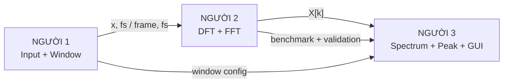
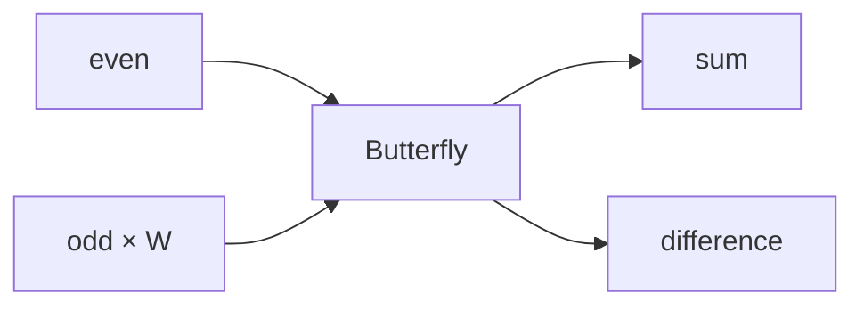
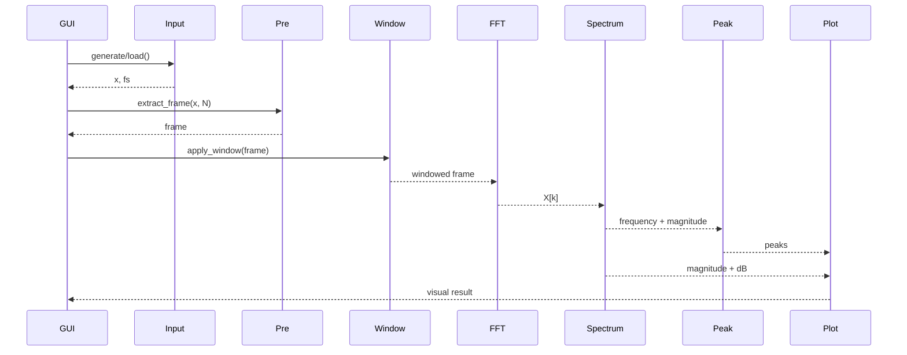
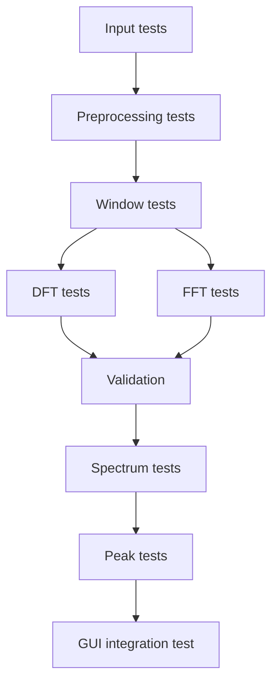

# REQUIREMENT 02 — Triển khai code

## 1. Mục tiêu

File này dùng trực tiếp khi bắt đầu code, giúp trả lời:

- Mỗi người làm gì?
- Phải biết lý thuyết nào?
- Viết file nào?
- Đầu vào của module là gì?
- Đầu ra của module là gì?
- Giao tiếp với người khác ra sao?
- Test thế nào?
- GUI đặt ở đâu?
- Khi nào một phần được coi là hoàn thành?

---

## 2. Kiến trúc source code thống nhất

Tất cả thành viên dùng chung cấu trúc:

```text
spectrum-analyzer/
│
├── README.md
├── requirements.txt
├── config.py
├── run.py
│
├── src/
│   ├── input/
│   │   ├── signal_generator.py
│   │   └── wav_loader.py
│   │
│   ├── dsp/
│   │   ├── preprocessing.py
│   │   ├── window.py
│   │   ├── dft.py
│   │   ├── fft.py
│   │   ├── spectrum.py
│   │   └── peak_detector.py
│   │
│   ├── analysis/
│   │   └── analyzer.py
│   │
│   ├── gui/
│   │   └── app.py
│   │
│   └── visualization/
│       └── plot.py
│
├── tests/
│   ├── test_signal_generator.py
│   ├── test_wav_loader.py
│   ├── test_window.py
│   ├── test_dft.py
│   ├── test_fft.py
│   ├── test_spectrum.py
│   └── test_peak_detector.py
│
├── experiments/
│   ├── exp_sine.py
│   ├── exp_multisine.py
│   ├── exp_resolution.py
│   ├── exp_leakage.py
│   ├── exp_harmonic.py
│   ├── exp_noise.py
│   └── exp_benchmark.py
│
├── data/
│   └── wav/
│
└── results/
    ├── figures/
    └── tables/
```

---

## 3. Quy tắc interface giữa các module

Đây là quy tắc quan trọng nhất để 3 người làm song song.

### Input chuẩn

Mọi tín hiệu sau input/preprocessing phải có:

```python
x: np.ndarray      # 1-D real-valued array
fs: float          # sample rate in Hz
```

Thông thường `x` được chuẩn hóa gần `[-1, 1]`.

### Frame chuẩn

```python
frame: np.ndarray  # shape = (N,)
fs: float
```

### FFT output chuẩn

```python
X: np.ndarray      # 1-D complex array, length N
```

### Spectrum output chuẩn

```python
freq: np.ndarray
magnitude: np.ndarray
db: np.ndarray
```

### Peak output chuẩn

Danh sách dictionary:

```python
[
    {
        "frequency": float,
        "magnitude": float,
        "db": float,
        "index": int,
    },
]
```

---

## 4. Luồng dữ liệu giữa 3 người



---

## 5. Người 1 — Input + Pre-processing + Window

### 5.1. Nhiệm vụ chính

Người 1 chuẩn bị dữ liệu đầu vào đúng chuẩn cho FFT.

Các việc:

1. Tạo sine.
2. Tạo multi-sine.
3. Tạo square.
4. Đọc WAV.
5. Chuyển stereo → mono.
6. Normalize.
7. Chọn frame `N` mẫu.
8. Zero padding khi cần.
9. Cài Rectangular/Hamming/Hann.

---

### 5.2. Lý thuyết phải biết

#### Sampling

Biết ý nghĩa của:

- `fs`;
- thời gian giữa các mẫu;
- Nyquist frequency `fs/2`.

#### DTFT ở mức khái niệm

Hiểu spectrum và tính đối xứng của phổ tín hiệu thực.

#### Frequency resolution

$$
\Delta f = \frac{f_s}{N}
$$

### Windowing

Hiểu:

- Rectangular window;
- Hamming window;
- Hann window;
- mainlobe;
- sidelobe;
- spectral leakage;
- trade-off resolution/leakage.

---

### 5.3. File `signal_generator.py`

API đề xuất:

```python
def generate_sine(
    frequency: float,
    amplitude: float,
    phase: float,
    fs: float,
    duration: float,
) -> tuple[np.ndarray, float]:
    ...


def generate_multi_sine(
    frequencies: list[float],
    amplitudes: list[float],
    phases: list[float],
    fs: float,
    duration: float,
) -> tuple[np.ndarray, float]:
    ...


def generate_square(
    frequency: float,
    amplitude: float,
    fs: float,
    duration: float,
) -> tuple[np.ndarray, float]:
    ...
```

**Output**

```text
x, fs
```

---

### 5.4. File `wav_loader.py`

API:

```python
def load_wav(path: str) -> tuple[np.ndarray, float]:
    ...
```

Yêu cầu:

- đọc sample rate;
- đọc dữ liệu;
- stereo → mono;
- trả về `float` array.

---

### 5.5. File `preprocessing.py`

API:

```python
def normalize_signal(x: np.ndarray) -> np.ndarray:
    ...


def extract_frame(
    x: np.ndarray,
    start: int,
    size: int,
) -> np.ndarray:
    ...


def zero_pad(
    x: np.ndarray,
    target_size: int,
) -> np.ndarray:
    ...
```

**Quy ước**

Nếu tín hiệu ngắn hơn `size`, padding theo quy định của nhóm.

---

### 5.6. File `window.py`

API:

```python
def get_window(name: str, N: int) -> np.ndarray:
    ...


def apply_window(
    x: np.ndarray,
    window: np.ndarray,
) -> np.ndarray:
    ...
```

Tên chuẩn:

```text
rectangular
hamming
hann
```

---

### 5.7. Test của người 1

**Test A**

Sine 1 kHz → kiểm tra waveform.

**Test B**

Multi-sine 1 kHz + 3 kHz.

**Test C**

Square 1 kHz.

**Test D**

Load WAV stereo → output mono.

**Test E**

Window Hamming/Hann có đúng chiều dài `N`.

---

### 5.8. Output bàn giao

```text
src/input/signal_generator.py
src/input/wav_loader.py
src/dsp/preprocessing.py
src/dsp/window.py

tests/test_signal_generator.py
tests/test_wav_loader.py
tests/test_window.py
```

và bộ dữ liệu mẫu trong:

```text
data/
```

Người 2 chỉ cần nhận:

```python
x, fs
```

hoặc:

```python
frame, fs
```

không cần biết code nội bộ của người 1.

---

## 6. Người 2 — DFT + Custom FFT + Validation + Benchmark

### 6.1. Nhiệm vụ chính

Người 2 chịu trách nhiệm **DSP core**:

1. Direct DFT.
2. Custom Radix-2 FFT.
3. Bit-reversal.
4. Butterfly.
5. Validation với DFT.
6. Validation với NumPy FFT.
7. Benchmark thời gian.

---

### 6.2. Lý thuyết phải biết

**DFT**

$$
X[k] = \sum_{n=0}^{N-1}x[n]e^{-j2\pi kn/N}
$$

**Twiddle factor**

$$
W_N^k=e^{-j2\pi k/N}
$$

**Radix-2 DIT**

Tách phần tử chẵn/lẻ và tính đệ quy.

**Butterfly**



**Bit-reversal**

Hiểu thứ tự input sau khi đảo bit chỉ mục.

**Complexity**

Nắm được ý nghĩa:

$$
O(N^2)
$$

cho DFT trực tiếp và:

$$
O(N\log_2N)
$$

cho FFT Radix-2.

---

### 6.3. File `dft.py`

API:

```python
def dft(x: np.ndarray) -> np.ndarray:
    ...
```

Yêu cầu:

- tự tính tổng theo công thức DFT;
- không gọi FFT bên trong;
- dùng làm reference implementation.

Không cần tối ưu.

---

### 6.4. File `fft.py`

API:

```python
def fft(x: np.ndarray) -> np.ndarray:
    ...
```

Yêu cầu:

- Radix-2 DIT;
- `N` phải là lũy thừa của 2;
- thực hiện butterfly;
- xử lý bit-reversal phù hợp với implementation;
- output length bằng input length;
- output complex.

Kiểm tra input:

```python
N = len(x)
```

Nếu không phải `N = 2^m`, phải báo lỗi rõ ràng.

---

### 6.5. File `validation.py`

API:

```python
def compare_dft_fft(
    x: np.ndarray,
) -> float:
    ...


def compare_fft_numpy(
    x: np.ndarray,
) -> float:
    ...
```

Có thể dùng:

```python
np.max(np.abs(X1 - X2))
```

để lấy sai số lớn nhất.

---

### 6.6. File `benchmark_fft.py`

Thử:

```text
N = 256
N = 512
N = 1024
N = 2048
N = 4096
```

So sánh:

```text
Direct DFT
Custom FFT
NumPy FFT
```

Output:

```text
results/tables/benchmark.csv
results/tables/accuracy.csv
results/figures/benchmark.png
results/figures/accuracy.png
```

---

### 6.7. Test của người 2

**Test A — FFT 4-point**

Dùng các vector nhỏ để kiểm tra bằng tay.

**Test B — FFT 8-point**

Kiểm tra output với DFT.

**Test C — Sine**

1 kHz, `Fs = 8000`, `N = 1024`.

**Test D — Multi-sine**

1 kHz + 3 kHz.

**Test E — Random vector**

Tạo vector random và so sánh custom FFT với NumPy FFT.

**Điều kiện pass đề xuất**

Sai số do floating-point phải nhỏ và ổn định ở mức phù hợp với kích thước `N`.

---

## 6.8. Output bàn giao

```text
src/dsp/dft.py
src/dsp/fft.py
src/dsp/validation.py
experiments/exp_benchmark.py

tests/test_dft.py
tests/test_fft.py
```

Người 3 chỉ cần dùng:

```python
X = fft(frame)
```

và không phụ thuộc vào implementation bên trong.

---

## 7. Người 3 — Spectrum + Peak Detection + Visualization + GUI

### 7.1. Nhiệm vụ chính

Người 3 biến `X[k]` thành một **Spectrum Analyzer hoàn chỉnh**:

1. Magnitude spectrum.
2. Frequency axis.
3. dB spectrum.
4. Peak detection.
5. Vẽ waveform.
6. Vẽ spectrum.
7. Tích hợp GUI.
8. Ghép các module từ người 1 và người 2.

---

### 7.2. Lý thuyết phải biết

**Magnitude**

$$
A[k] = |X[k]|
$$

**Frequency axis**

$$
f_k = \frac{kf_s}{N}
$$

**Spectrum một phía**

Với tín hiệu thực, hiển thị:

$$
0\le f\le f_s/2
$$

**dB**

$$
X_{dB}[k] = 20\log_{10}(A[k]+\epsilon)
$$

**Peak detection**

Hiểu các khái niệm:

- peak height;
- threshold;
- minimum distance;
- dominant frequency.

---

### 7.3. File `spectrum.py`

API:

```python
def frequency_axis(fs: float, N: int) -> np.ndarray:
    ...


def one_sided_magnitude(
    X: np.ndarray,
    N: int,
) -> np.ndarray:
    ...


def magnitude_to_db(
    magnitude: np.ndarray,
    eps: float = 1e-12,
) -> np.ndarray:
    ...
```

Quy ước output one-sided phải đồng nhất với frequency axis.

---

### 7.4. File `peak_detector.py`

API:

```python
def detect_peaks(
    frequency: np.ndarray,
    magnitude: np.ndarray,
    threshold: float,
    min_distance: int,
) -> list[dict]:
    ...
```

Có thể dùng `scipy.signal.find_peaks` để triển khai detection.

Output phải theo format chung:

```python
{
    "frequency": ...,
    "magnitude": ...,
    "db": ...,
    "index": ...,
}
```

---

## 8. Visualization

### File `plot.py`

API đề xuất:

```python
def plot_time_domain(
    ax,
    x: np.ndarray,
    fs: float,
):
    ...


def plot_spectrum(
    ax,
    frequency: np.ndarray,
    magnitude: np.ndarray,
    peaks: list[dict] | None = None,
):
    ...


def plot_db_spectrum(
    ax,
    frequency: np.ndarray,
    db: np.ndarray,
    peaks: list[dict] | None = None,
):
    ...
```

Các đồ thị phải có:

- title;
- xlabel;
- ylabel;
- grid;
- đơn vị rõ ràng.

---

## 9. GUI bằng Tkinter

### 9.1. Mục tiêu

GUI phục vụ demo, không phải một sản phẩm thương mại.

### 9.2. Bố cục đề xuất

```text
┌─────────────────────────────────────────────────────────────┐
│              DIGITAL SPECTRUM ANALYZER                      │
├───────────────────────┬─────────────────────────────────────┤
│ INPUT                 │ SIGNAL INFORMATION                  │
│ Source [Generated ▼]  │ Fs: 8000 Hz                         │
│ Type   [Sine ▼]       │ N : 1024                            │
│ Freq   [1000]         │ Window: Hamming                     │
│ Amp    [1.0]          │ Δf: 7.8125 Hz                       │
│ Phase  [0]            │                                     │
│                       │                                     │
│ [Load WAV]            │                                     │
│                       │                                     │
│ FFT SETTINGS          │                                     │
│ FFT [1024 ▼]          │                                     │
│ Window [Hamming ▼]    │                                     │
│                       │                                     │
│ [ ANALYZE ] [ RESET ] │                                     │
├───────────────────────┴─────────────────────────────────────┤
│ TIME DOMAIN                                                 │
│                                                             │
│                    waveform                                 │
│                                                             │
├─────────────────────────────────────────────────────────────┤
│ FREQUENCY SPECTRUM                                          │
│                                                             │
│                        peak                                 │
│                         /                                   │
│                                                             │
├─────────────────────────────────────────────────────────────┤
│ PEAK TABLE                                                  │
│ Peak 1: 1000 Hz | 0.98 | -0.2 dB                            │
│ Peak 2: 3000 Hz | 0.49 | -6.2 dB                            │
└─────────────────────────────────────────────────────────────┘
```

> Khi hiện thực thật, chỉ cần một layout đơn giản bằng Tkinter `Frame`, `Label`, `Entry`, `Combobox`, `Button`, `Treeview` và vùng Matplotlib embedded là đủ.

---

## 10. File `analyzer.py`

Đây là lớp/service tích hợp DSP.

API đề xuất:

```python
class SpectrumAnalyzer:
    def analyze(
        self,
        x: np.ndarray,
        fs: float,
        fft_size: int,
        window_name: str,
    ) -> dict:
        ...
```

Output:

```python
{
    "frame": frame,
    "windowed": windowed,
    "fft": X,
    "frequency": freq,
    "magnitude": magnitude,
    "db": db,
    "peaks": peaks,
    "fs": fs,
    "fft_size": fft_size,
    "window": window_name,
    "frequency_resolution": fs / fft_size,
}
```

Đây là interface mà GUI sử dụng.

---

## 11. `run.py`

`run.py` chỉ khởi chạy ứng dụng:

```python
from src.gui.app import run_app

if __name__ == "__main__":
    run_app()
```

Không đặt code FFT hoặc plotting trực tiếp vào `run.py`.

---

## 12. Luồng gọi code hoàn chỉnh



---

## 13. Bộ test tích hợp

### T01 — Sine 1 kHz

```text
Fs = 8000
N = 1024
f = 1000
A = 1
Window = Rectangular
```

Expected:

```text
dominant peak ≈ 1000 Hz
```

---

### T02 — Multi-sine

```text
f1 = 1000 Hz, A1 = 1
f2 = 3000 Hz, A2 = 0.5
```

Expected:

```text
peak 1 ≈ 1000 Hz
peak 2 ≈ 3000 Hz
```

---

### T03 — Resolution

```text
f1 = 1000 Hz
f2 = 1010 Hz
```

Chạy nhiều FFT sizes và lưu kết quả.

---

### T04 — Leakage

Tần số không trùng FFT bin.

So sánh:

```text
Rectangular
Hamming
Hann
```

---

### T05 — Harmonic

```text
Square wave = 1 kHz
```

Quan sát các harmonic lẻ chính.

---

### T06 — Noise

Cộng Gaussian noise và kiểm tra peak detection.

---

### T07 — WAV

Nạp WAV, chọn frame, phân tích và hiển thị spectrum.

---

## 14. Test đơn vị từng module



### Người 1

- shape đúng;
- `fs` đúng;
- waveform đúng;
- window length đúng.

### Người 2

- DFT/FFT output đúng;
- sai số với NumPy nhỏ;
- benchmark chạy.

### Người 3

- frequency axis đúng;
- magnitude/dB đúng;
- peak đúng;
- GUI hiển thị đầy đủ.

---

## 15. Dữ liệu trao đổi giữa 3 người

### 15.1. Người 1 → Người 2

```python
x, fs
```

Người 2 cần biết:

- `x` là 1-D array;
- `fs` tính bằng Hz;
- frame length bằng FFT size trước khi FFT.

### 15.2. Người 2 → Người 3

```python
X
```

Người 3 chỉ gọi:

```python
X = fft(frame)
```

Không được phụ thuộc vào biến nội bộ của FFT.

## 15.3. Người 3 → GUI

`analyzer.py` trả một dictionary kết quả duy nhất.

GUI không tự tính FFT.

---

## 16. Phân công file chính thức

| Thành viên | File chính | File test | Output |
|---|---|---|---|
| **Người 1** | `signal_generator.py`, `wav_loader.py`, `preprocessing.py`, `window.py` | `test_signal_generator.py`, `test_wav_loader.py`, `test_window.py` | `x`, `fs`, `frame`, window |
| **Người 2** | `dft.py`, `fft.py`, `validation.py` | `test_dft.py`, `test_fft.py` | `X[k]`, accuracy, benchmark |
| **Người 3** | `spectrum.py`, `peak_detector.py`, `plot.py`, `analyzer.py`, `app.py` | `test_spectrum.py`, `test_peak_detector.py` | spectrum, peaks, GUI |

Các file:

```text
config.py
run.py
README.md
requirements.txt
```

được thống nhất và tích hợp chung.

---

## 17. Phân công phần báo cáo

### Người 1

Viết:

- tín hiệu rời rạc;
- DTFT khái niệm;
- sampling;
- windowing;
- frequency resolution.

### Người 2

Viết:

- DFT;
- FFT;
- Radix-2;
- butterfly;
- bit-reversal;
- complexity;
- validation DFT/FFT.

### Người 3

Viết:

- magnitude spectrum;
- frequency axis;
- dB spectrum;
- peak detection;
- GUI;
- kết quả tích hợp.

Cả nhóm cùng viết:

- phần mở đầu;
- kết luận;
- đánh giá tổng thể.

---

# 18. Output file của từng task

## Người 1

```text
results/figures/input_waveform_*.png
```

Ví dụ:

```text
sine_1k.png
multisine.png
square_1k.png
window_comparison.png
```

## Người 2

```text
results/tables/accuracy.csv
results/tables/benchmark.csv
results/figures/benchmark.png
results/figures/accuracy.png
```

## Người 3

```text
results/tables/peak_results.csv
results/figures/spectrum_*.png
results/figures/leakage_*.png
results/figures/resolution_*.png
```

---

## 19. Tiêu chí hoàn thành từng người

### Người 1 — Done khi

```text
[ ] Generate sine
[ ] Generate multi-sine
[ ] Generate square
[ ] Load WAV
[ ] Stereo → mono
[ ] Normalize
[ ] Extract frame
[ ] Zero padding
[ ] Rectangular
[ ] Hamming
[ ] Hann
[ ] Unit tests pass
```

### Người 2 — Done khi

```text
[ ] Direct DFT
[ ] Radix-2 FFT
[ ] Bit-reversal
[ ] Butterfly
[ ] FFT size validation
[ ] Compare DFT
[ ] Compare NumPy FFT
[ ] Benchmark
[ ] Unit tests pass
```

### Người 3 — Done khi

```text
[ ] Magnitude
[ ] Frequency axis
[ ] dB
[ ] Peak detection
[ ] Time plot
[ ] Spectrum plot
[ ] Peak table
[ ] Analyzer integration
[ ] Tkinter GUI
[ ] Integration test pass
```

---

## 20. Tiến độ 4 tuần

### Tuần 1 — Nền tảng

```text
Người 1 → Input + Window
Người 2 → DFT + FFT cơ bản
Người 3 → Spectrum + plotting cơ bản
```

**Mốc cuối tuần:**

```text
sine → custom FFT → spectrum
```

---

### Tuần 2 — Ghép module

```text
Input
 ↓
Pre-processing
 ↓
Window
 ↓
FFT
 ↓
Spectrum
 ↓
Peak
```

**Mốc cuối tuần:** chương trình CLI hoặc prototype GUI chạy được.

---

### Tuần 3 — Thí nghiệm

Hoàn thành:

- DFT vs FFT;
- FFT vs NumPy;
- resolution;
- leakage;
- harmonic;
- noise;
- WAV.

**Mốc cuối tuần:** có toàn bộ số liệu báo cáo.

---

### Tuần 4 — GUI + báo cáo + demo

- hoàn thiện Tkinter;
- sửa lỗi tích hợp;
- lưu figures/tables;
- viết báo cáo;
- làm slide;
- luyện demo.

---

## 21. Git workflow

Mỗi người tạo branch riêng:

```text
feature/person1-input-window
feature/person2-dft-fft
feature/person3-spectrum-gui
```

Sau khi hoàn thành một phần:


Không sửa trực tiếp `main`.

---

## 22. Checklist tích hợp cuối cùng

Trước khi kết luận project hoàn thành, phải kiểm tra:

```text
[ ] Tạo sine 1 kHz
[ ] Spectrum có peak ~1 kHz
[ ] Multi-sine có hai peak
[ ] Custom FFT khớp DFT
[ ] Custom FFT khớp NumPy FFT
[ ] Frequency axis đúng
[ ] Magnitude scale hợp lý
[ ] dB spectrum hoạt động
[ ] Hamming/Hann hoạt động
[ ] Resolution experiment có kết quả
[ ] Leakage experiment có kết quả
[ ] Square harmonic có kết quả
[ ] Noise test có kết quả
[ ] WAV input hoạt động
[ ] GUI hoạt động
[ ] Peak table hiển thị
[ ] Results được lưu thành file
[ ] README chạy được từ đầu đến cuối
```

---

## 23. Điều kiện hoàn thành của toàn project

Project được coi là hoàn thành khi:

1. Người dùng có thể tạo hoặc nạp tín hiệu.
2. Người dùng chọn được FFT size và window.
3. Hệ thống chạy **custom Radix-2 FFT**.
4. Hệ thống hiển thị waveform và spectrum.
5. Hệ thống phát hiện được các peak chính.
6. Có bảng kết quả và thông số phân tích.
7. Custom FFT được kiểm chứng với DFT và NumPy FFT.
8. Hoàn thành các thí nghiệm resolution, leakage, harmonic, noise.
9. GUI chạy ổn định cho toàn bộ flow.
10. Có source code, test, results, README và báo cáo.

---

## 24. Lưu ý triển khai

### Không đưa thuật toán vào GUI

GUI chỉ gọi service.

### Không tính DFT mỗi lần người dùng bấm Analyze

Direct DFT chỉ dùng cho validation/benchmark.

### Không dùng `numpy.fft.fft()` làm FFT chính

`numpy.fft.fft()` chỉ dùng để **đối chứng**.

### Không làm GUI trước khi FFT chạy đúng

Thứ tự phải là:

```text
DFT → FFT → Spectrum → Peak → GUI
```

### Không thay đổi interface giữa chừng

Nếu cần đổi API, cả nhóm phải thống nhất trước khi merge.

---
